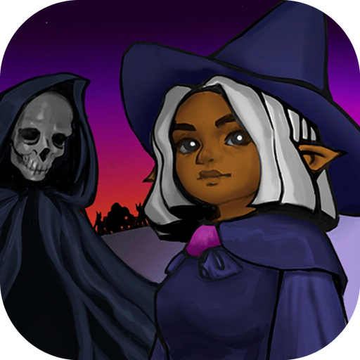

Programming is my passion because it allows me to craft expansive and extraordinary systems ⚙️.  
When combined with mathematics 📏, it truly feels like conjuring magic 🌈.  
Imagine what unfolds when we integrate physics 🧲 and biology 🔬. The only limit is one's imagination 🌌.  
 
So, I just want to continue to have the opportunity to create, and develop in this area,  
so that I can create more and more amazing things ✏️

   
  <table>
    <tr>
      <td align="center" width="130">
        <a href="https://github.com/wismh/sorcery-strife">
           
          <b>Sorcery Strife</b>
        </a>
      </td>
      <!-- Add more games here by adding <td>...</td> blocks -->
    </tr>
  </table>
   
  

