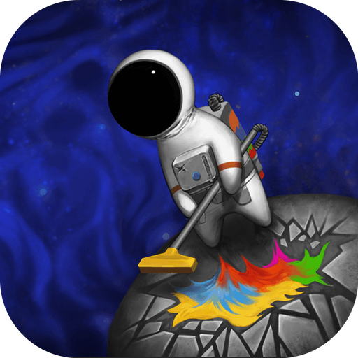
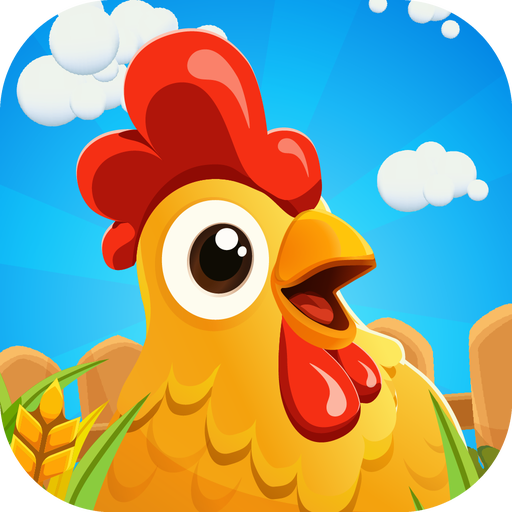
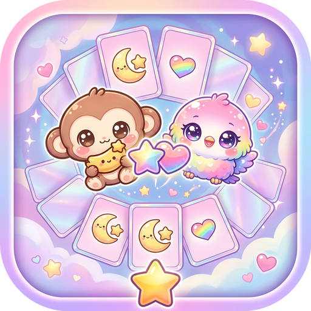
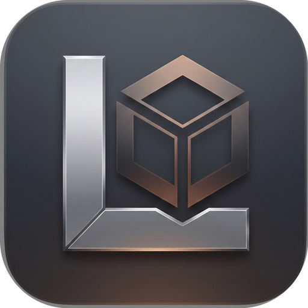
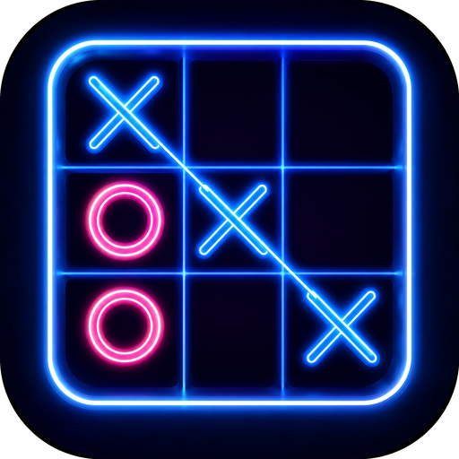
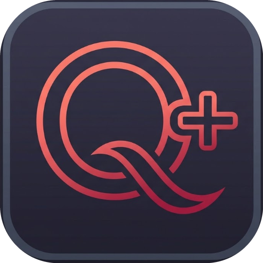
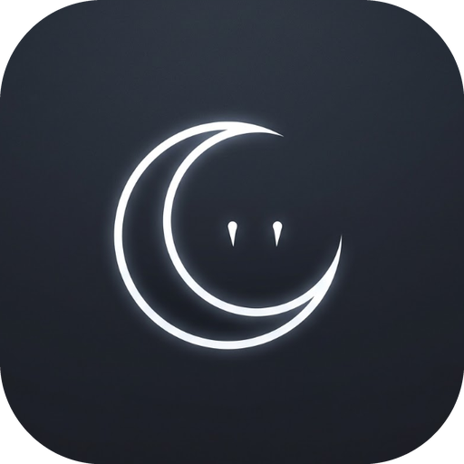
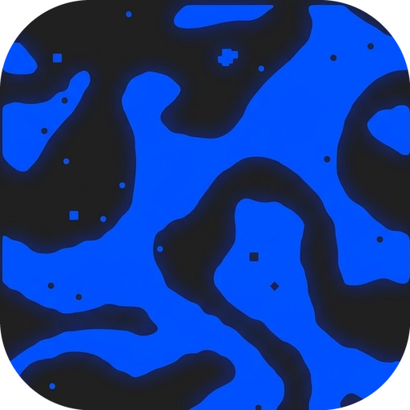

<h5>
  Unity Developer with a passion for game architecture, performance, and understanding what happens under the hood.
  
  I ship cross-platform games (PlayStation, VR, Mobile, PC). Focused on scalable game architecture, performance profiling, and low-level engine internals.

  - Production: Unity (C#), Zenject/VContainer, UniTask, Netcode, Addressables, automated CI/CD pipelines (GameCI/GitHub Actions).
  - Systems & Under the Hood: C++, Rust, memory management, cache-efficient design, toy OS & compiler experiments.
  - Platforms: PlayStation SDK, Meta Quest / OpenXR, Steam, iOS/Android.

  I design decoupled architectures that prevent technical debt, optimize memory/frame budgets on constrained hardware
</h5>

  

  
   
  <h1>My Own Projects:</h1>
   
  <table>
    <tr>
      <td align="center" width="130" valign="top">
        
         
        <b>Space Bac</b>
         
        
      </td>
      <td align="center" width="130" valign="top">
        
         
        <b>Farm Fusion</b>
         
        
      </td>
      <td align="center" width="130" valign="top">
        
         
        <b>Toolbar Shortcuts</b>
         
        
      </td>
      <td align="center" width="130" valign="top">
        
         
        <b>Memory Cards</b>
         
        
      </td>
      <td align="center" width="130" valign="top">
        
         
        <b>Unity Template</b>
         
        
      </td>
    </tr>
  </table>
   
  <table>
    <tr>
      <td align="center" width="130" valign="middle">
        
         
        <b>Sorcery Strife</b>
         
        
      </td>
      <td valign="middle" align="left">
        A top-down arena horde survival game simulating thousands of on-screen enemies simultaneously. Built on Unity 6 leveraging <b>Unity DOTS/ECS (Entities)</b> for massive crowd simulations and <b>VAT (Vertex Animation Textures)</b> for ultra-efficient GPU-instanced character animations, alongside auto-cast spell mechanics, deep item progression, Zenject DI, and UniTask.
      </td>
    </tr>
    <tr>
      <td align="center" width="130" valign="middle">
        
         
        <b>Wind Engine</b>
         
        
      </td>
      <td valign="middle" align="left">
        A lightweight, embeddable cross-platform 2D C++23 game engine running across Windows, Web (WebAssembly), and Android. Features an Entity Component System (ECS), asset catalogs, declarative XML/CSS UI system, and a command-buffer renderer with optional SDL3, OpenGL, and audio backends.
      </td>
    </tr>
    <tr>
      <td align="center" width="130" valign="middle">
        
         
        <b>Tic Tac Toe</b>
         
        
      </td>
      <td valign="middle" align="left">
        A neon-styled Tic-Tac-Toe game cross-platform on Windows, Web, and Android. Features PvP and PvE (smart bot) modes, procedural UI, sound effects, looping soundtrack, and score tracking, built from scratch entirely on top of the custom Wind C++23 engine.
      </td>
    </tr>
    <tr>
      <td align="center" width="130" valign="middle">
        
         
        <b>Q+</b>
         
        
      </td>
      <td valign="middle" align="left">
        A custom statically-typed programming language combining Rust-like syntax and ergonomics with simplicity (no ownership, lifetimes, or class inheritance). Includes a custom <code>qpc</code> compiler that transpiles directly to clean, efficient C++.
      </td>
    </tr>
    <tr>
      <td align="center" width="130" valign="middle">
        
         
        <b>VampireOS</b>
         
        
      </td>
      <td valign="middle" align="left">
        A hobby 64-bit (x86_64) operating system built from scratch with an MBR BIOS bootloader, freestanding C kernel, physical memory manager (PMM + HHDM), copy-on-write <code>fork</code>, virtual memory (<code>mmap</code>/<code>brk</code>), pipes, signals, and a userland shell booting in QEMU.
      </td>
    </tr>
    <tr>
      <td align="center" width="130" valign="middle">
        
         
        <b>Cellular Automata</b>
         
        
      </td>
      <td valign="middle" align="left">
        A modular, real-time cellular automata playground built with Rust and Dear ImGui. Allows running, exploring, and visualizing various Life-like 2D automata rules (Conway's Life, Anneal, HighLife, Day &amp; Night) with dynamic parameter controls and presets.
      </td>
    </tr>
  </table>
   

